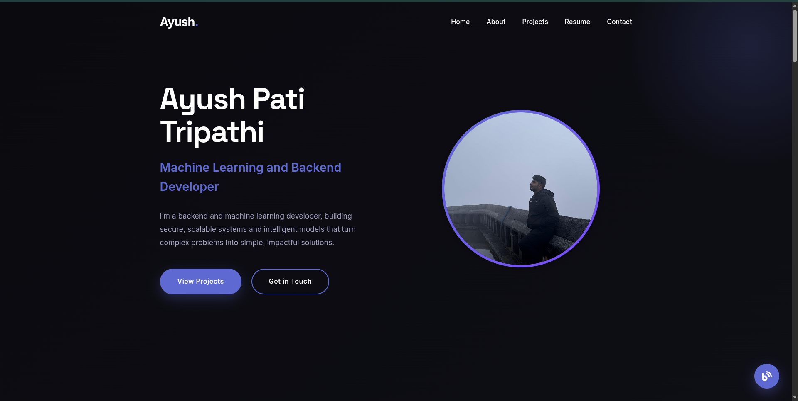

# 🌐 Ayush Pati Tripathi - Portfolio Website

This is my personal portfolio website showcasing my work as a **Backend & Machine Learning Developer**.  
It highlights my projects, skills, experience, and also features a blog section where I share insights and updates about my journey in development.

---

## 🚀 Features
- **Responsive Design** – Works seamlessly across devices  
- **Hero Section** – Introduction with tagline and call-to-actions  
- **About Me** – Background, skills, and experience  
- **Projects** – Showcase of featured projects with tech stack details  
- **Blog Section** – Placeholder for blog posts (to be linked with Django backend)  
- **Resume Section** – Education, skills, and certifications  
- **Contact Section** – Email, phone, and contact form  
- **Animations** – Smooth scroll and fade-in effects for engaging UI  

---

## 🛠️ Tech Stack
- **Frontend:** HTML5, CSS3, JavaScript (Vanilla)  
- **Styling:** Custom CSS, Google Fonts, Font Awesome Icons  
- **Backend (Planned):** Django + REST API (for blog integration and contact form)  
- **Deployment:**  hosted on GitHub Pages

---

---

## 📸 Preview
  

---

## 🔮 Future Enhancements
- Integrate **dynamic blog system** with Django  
- Contact form email integration (via Django or Formspree API)  
- Add **dark/light mode toggle**  
- Deploy live with custom domain  

---

## 📬 Contact
- **Email:** ayushtripathi218@gmail.com  
- **LinkedIn:** [linkedin.com/in/ayushpatitripathi](https://www.linkedin.com/in/ayushpatitripathi/)  
- **GitHub:** [github.com/AyushPatiTripathi](https://github.com/AyushPatiTripathi)  

---

## 📜 License
This project is open-source under the [MIT License](LICENSE).  
Feel free to use it as inspiration for your own portfolio, but please give credit.

---
✨ Built with ❤️ by **Ayush Pati Tripathi**

